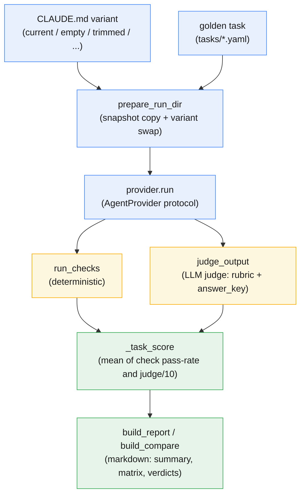

# Gauntlet

A benchmark harness that answers one question about a context file: is this
`CLAUDE.md` earning its tokens, or is it just long?

[](https://www.python.org/)
[](https://github.com/blaine-hiers/Gauntlet/actions/workflows/ci.yml)
[](LICENSE)

Teams accumulate context files the way codebases accumulate config. A section
gets added after a bad answer and never removed, and nobody can say which parts
are still doing work, because nobody measured. Gauntlet measures: freeze the
corpus, swap the context file, run the same golden tasks, compare the scores.

A worked example ships with it, so the harness runs end to end on a clean clone
with nothing but `pip install`.

## How a run scores one task

Each golden task runs once per `CLAUDE.md` variant (`current`, `empty`, and
anything else configured), and its output is scored through two independent
gates that combine into one composite:



The deterministic gate (`gauntlet/scoring.py`) and the LLM judge
(`gauntlet/judge.py`) run independently — a task can carry either one or both,
and `_task_score` in `gauntlet/report.py` blends whichever components exist
rather than letting a clean check pass mask a bad judge score (see
[The scoring had a defect](#the-scoring-had-a-defect-and-it-is-still-documented-in-the-source)).

### Deterministic check types

| Type | Targets `$response`? | Passes when |
|---|---|---|
| `file_exists` | no | the file exists |
| `file_not_exists` | no | the file does not exist |
| `file_contains` | yes | the file (or the model's answer) contains the given text |
| `file_not_contains` | yes | it does not contain the given text |
| `file_matches` | yes | the file (or answer) matches the given regex |
| `file_unchanged` | no | the file's hash still matches the frozen snapshot |
| `snapshot_unchanged` | n/a | nothing in the whole run directory drifted from the snapshot, apart from an `allow`-listed set of paths |

`$response` targets the model's own answer text instead of a file on disk.
It is rejected at task-load time for `file_exists`, `file_not_exists` and
`file_unchanged` (enforced in `gauntlet/tasks.py`): asking whether the
model's answer exists on disk is a question with no honest answer.

## Quickstart

```bash
pip install -r requirements.txt

python -m gauntlet.cli snapshot              # freeze the corpus
python -m gauntlet.cli run --label baseline  # every task, every variant
python -m gauntlet.cli report --label baseline  # scored markdown report
```

`gauntlet.config.json` ships pointed at the bundled demo corpus, so a clean
clone runs end to end with no setup. Point `synced_root` at a real knowledge
base for real numbers.

## The design decisions that matter

Most of the work in an eval harness is in the parts that stop it lying to you.
These are the ones worth reading the code for.

### It grades outcomes, not obedience

The judge prompt is explicit: *"an output that follows instructions but is
unhelpful or wrong scores low."* A model that ignored the prescribed steps and
produced the right answer passes. A model that followed every instruction and
produced a confident, wrong answer fails.

That is the difference between measuring whether a system works and measuring
whether it complies, and they are not the same number.

### Every task carries two independent gates

**Deterministic checks** run after the model finishes, against the filesystem
and, via `path: "$response"`, against the model's own answer — see the table
above. These cannot be argued with by anyone, including the judge.

The negative ones earn their keep. `file_unchanged` hashes a path before and
after, so a read-only task proves it stayed read-only rather than reporting
that it did. `snapshot_unchanged` widens that to the entire run directory and
names every path that drifted, which measures blast radius instead of trusting
that nothing else was touched.

**An LLM judge** scores 0 to 10 against a rubric *and an answer key*. The rubric
names the specific traps, so a plausible-sounding wrong answer scores badly
instead of passing on tone:

```yaml
id: fa-dc-count
category: find-answer
prompt: "How many distribution centers does Meridian Tools operate today?"
checks:
  - type: file_unchanged
    path: "QUICK ANSWERS - Meridian Fact Index.md"
judge:
  rubric: "Must state THREE and name them. Must NOT claim a Jacksonville DC exists."
  answer_key: "Ashgrove TN, Baytown TX, Cordell OK."
```

Without an answer key you are asking one model whether another model sounded
convincing. That is a vibe, not a measurement.

The judge is itself a stochastic call, so two of its failure modes are handled
rather than hoped away. `--judge-samples K` grades each row K times and takes
the median, for rubrics genuinely close to the line. An unparseable reply is
retried once, on unparseable output only and never on a timeout, because
retrying a timeout buys a second bill for the same answer. If it still cannot
be parsed the row scores `None` and appears under **Degraded Judge Rows**
instead of vanishing from the mean, and the raw reply is kept on every row for
audit.

A task needs at least one of the two gates. Four categories are valid:
`find-answer`, `file-organize`, `draft-deliverable`, `framework-upkeep`.

### The `empty` variant is the floor

Variants map a name to a CLAUDE.md replacement:

| Value | Means |
|---|---|
| `null` | the snapshot's own CLAUDE.md, unmodified |
| `""` | no CLAUDE.md at all |
| a path | that file, substituted in |

**If a context file cannot beat having no context file, it is costing tokens for
nothing.** Most context files have never been tested against that baseline, and
some of them lose.

### One run is one sample, not a result

Every task by variant cell is a single draw from a stochastic process. A harness
that runs each cell once and reports the difference is reporting noise with a
decimal point on it.

`--repeats N` runs each cell N times. The report shows mean and standard
deviation, and a task is only flagged when the `empty` variant beats `current`
**by more than the standard error of the difference**. That gate is the
difference between "this section might not be pulling its weight" and "this
section is not pulling its weight."

Two economics details, because a benchmark nobody can afford to re-run does not
get re-run:

- Raising `--repeats` on an existing label **tops the cells up** instead of
  starting over.
- A cell whose run errored (timeout, crash) is excluded from scoring but still
  counts as recorded, so a plain re-run does not re-spend on it. `--retry-errors`
  runs those cells again when you actually want them retried.

### Contamination isolation, in both directions

Context leaks into a run from two places, and both have to be closed or the A/B
contrast is measuring nothing.

**From the directory tree.** Claude Code loads `CLAUDE.md` and
`.claude/CLAUDE.md` from the working directory and every ancestor up to the
filesystem root. Runs therefore execute under the system temp root rather than
inside the repository, so they cannot inherit the project's own context.

But the ancestor walk does not stop at the temp root. **On Windows the temp
directory sits under the user's home**, which puts `~/.claude/CLAUDE.md` on the
path as though it were project context, and the `empty` variant is quietly no
longer empty. So before a run starts the harness checks every ancestor of the
run directory and **refuses to run** if any of them holds a context file. Set
`work_root` to a directory outside your home when that happens. The directory
used is recorded on every row.

**From the user's settings.** Claude Code also loads the invoking user's
`~/.claude` settings regardless of working directory: user memory, enabled
plugins, skills and MCP servers. The runner passes
`--setting-sources project,local` so user-scope settings and memory are not
read, and `--strict-mcp-config` so no MCP server loads at all. Both flags are
recorded on every row.

Both were verified against claude 2.1.261 with marker files: under those flags a
run reads the run directory's own `CLAUDE.md` and nothing from `~/.claude`,
*provided* no ancestor holds one. These are the details that decide whether the
numbers mean anything, and they are easy to get wrong without noticing that you
got it wrong.

### The scoring had a defect, and it is still documented in the source

Composite task scores originally blended so that a full set of passing
deterministic checks could mask a bad judge score. A task looked green while the
judge was quietly rating the output a three.

`_task_score` now averages the check pass fraction and the judge score as
separate components, using whichever exist. The comment naming this as a
baseline defect was left in place, because a harness that hides its own
correction history is asking for trust it has not earned.

## What a run produces

A markdown report in three parts:

- **Variant summary**: check pass rate, mean judge score, total cost in USD, and
  the efficiency pair **Score/$** and **Score/turn**. Cost is tracked because
  "the longer context scored slightly better" is a different conclusion when it
  also cost four times as much. Both ratios are sum over sum rather than mean
  over sum, computed across one consistent row set, so a row missing its
  denominator is skipped instead of quietly inflating the number.
- **Per-task matrix**: every task against every variant as mean and standard
  deviation, so one regression is visible instead of averaged away, with a
  per-category breakdown underneath.
- **Degraded Judge Rows**: every row whose judge output could not be parsed,
  listed rather than omitted, so a thin mean is visibly thin.
- **Verdicts**: tasks where `empty` beat `current` by more than the standard
  error of the difference. That list is the point of the whole exercise.

Each report also records the provenance of the snapshot it scored, so a number
can be traced back to the corpus that produced it.

## Running it — full command reference

```bash
pip install -r requirements.txt

python -m gauntlet.cli snapshot                        # freeze the corpus
python -m gauntlet.cli lint                            # static findings on CLAUDE.md
python -m gauntlet.cli run --label baseline            # every task, every variant
python -m gauntlet.cli run --label baseline --repeats 5  # five samples per cell
python -m gauntlet.cli run --label baseline --concurrency 4  # four cells at once
python -m gauntlet.cli ablate --label ablation-1       # one variant per section
python -m gauntlet.cli report --label baseline         # scored markdown report
python -m gauntlet.cli compare --labels a,b            # diff two labelled runs
```

Twelve cells at up to 900 seconds each is a long serial wait, and `--repeats`
multiplies it. `--concurrency N` runs N cells at once; the default is 1, so
serial stays the default and nothing changes unless you ask for it. Run
directories are already named by a hash of task, variant, model and repeat, so
parallel cells cannot collide, and the append to `results.jsonl` is locked and
still flushed per row, so an interrupted sweep resumes from exactly what reached
disk. Each cell's console output is buffered and emitted in one piece rather
than interleaved with its neighbours.

The serial path is kept deliberately separate from the pool: at `--concurrency 1`
a failing cell stops the run instead of paying for every cell already queued
behind it.

| Flag | Does |
|---|---|
| `--variants` | restrict a run to a subset of configured variants |
| `--tasks-dir` | point at a different golden-task directory |
| `--model` | override the configured model for one run |
| `--judge-samples` | median several judge calls per row |
| `--retry-errors` | re-run cells that previously errored |

Re-run under a new label whenever a model ships or the context file changes
materially, then `compare`. That is the workflow the harness exists for.

## Section ablation

The whole-file A/B answers "is this context file worth having". It cannot answer
"which half of it is dead weight", and `lint` only scores sections statically, by
counting tokens and imperatives, which measures size and tone rather than effect.

`ablate` closes that gap. It decomposes the snapshot's CLAUDE.md, writes one
synthetic variant per section removed (`minus-<slug>`), runs the same golden
tasks against the same frozen corpus, and reports the delta.

```bash
python -m gauntlet.cli ablate --label ablation-1 --repeats 5 --concurrency 4
```

**A section runs from its heading to the next heading at the same or a shallower
level**, so removing a `##` takes its `###` children with it. That is the part
worth getting right: `lint`'s splitter is flat, and reusing it would have
orphaned the children and then scored a file nobody asked for. `--max-depth`
caps what is offered, defaulting to 2, because every level multiplies the grid
and a `####` is rarely a unit anyone would delete on its own.

The report puts the static lint columns next to the measured delta on one row.
A section that lints as large and turns out to change nothing is the finding
worth acting on, and it is only visible when both numbers sit together. `No harm`
counts tasks where the ablated file matched or beat the full one **by more than
the standard error of the difference**, the same gate the whole-file verdicts
use, so a single sample can never produce a cut recommendation.

`sections × variants × tasks × repeats` grows fast and every cell is a paid call,
so the planned cell count is printed before anything runs and a grid past
`--threshold` asks for confirmation. With no usable stdin the answer is no.

## Providers

The thing that executes a task is an axis of the comparison, not a fixed
dependency, so it sits behind an interface. `AgentProvider` takes a task and a
prepared run directory and returns a result row; `ClaudeCliProvider` is today's
behaviour unchanged.

An optional `providers` map in the config names them:

```json
"providers": {
  "fast": { "model": "claude-haiku-4-5" },
  "deep": { "kind": "claude-cli", "model": "claude-opus-5" }
}
```

**Leaving the key out means one implicit Claude provider on `model`**, which is
what every config written before this existed describes, so nothing has to
change and `--model` keeps overriding exactly as it did. A provider with no
`model` of its own inherits that default. An unknown `kind` is a hard error
rather than a skip: dropping it quietly would produce a report that looks
complete while missing an axis the config asked for.

Runs fan out over providers, and the run-directory hash includes the provider
name, so two providers can never score each other's leftovers.

### Cross-provider numbers are labelled, not just printed

When results span more than one provider **kind**, the report says so above the
tables: a tool loop is not another tool loop, so an absolute gap between two
providers measures the scaffolds at least as much as the models. The defensible
reading is within one provider, comparing its own CLAUDE.md variants. Two
providers of the *same* kind (two Claude models, say) carry no such warning,
because that comparison is legitimate.

**Not built yet:** the OpenAI-compatible provider that would let a self-hosted
model take the same tasks. It needs a tool loop, a path jail confined to the run
directory, and token accounting that reports `local` rather than a flattering
`$0.00` next to Claude's real spend. It also needs an endpoint to build against.

## Corpus handling

The snapshot copier tolerates what breaks a naive `shutil.copytree` on a real
knowledge base: files locked by a sync client, paths over the Windows length
limit, and read-only attributes that block deletion. Skipped files are reported
rather than swallowed, because a corpus that quietly lost three documents
produces confident numbers about the wrong thing.

## Layout

```
gauntlet/       cli, snapshot, runner, providers, judge, scoring, lint, ablate, report
tasks/          golden tasks in YAML, plus one skeleton per category
corpus/         bundled demo knowledge base
variants/       CLAUDE.md replacements for A/B runs
data/           snapshots and run output (gitignored)
tests/          unit tests
```

`tasks/README.md` covers task authoring in full.

## Testing

```bash
python -m pytest
```
